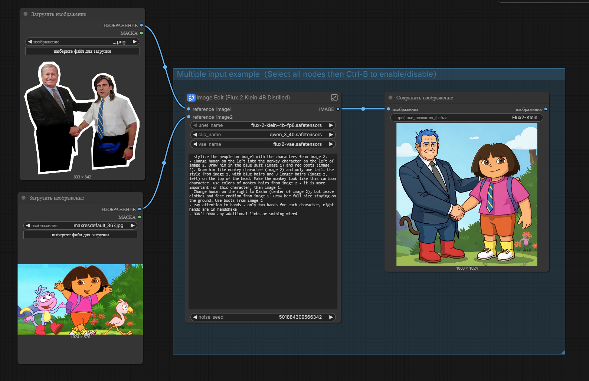
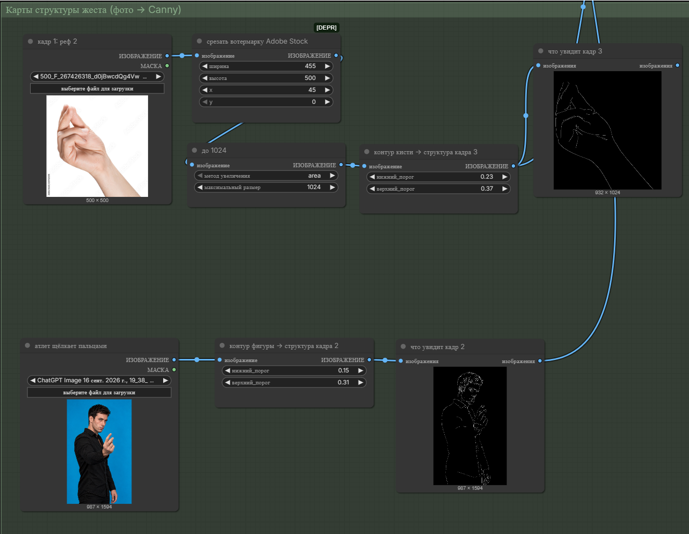
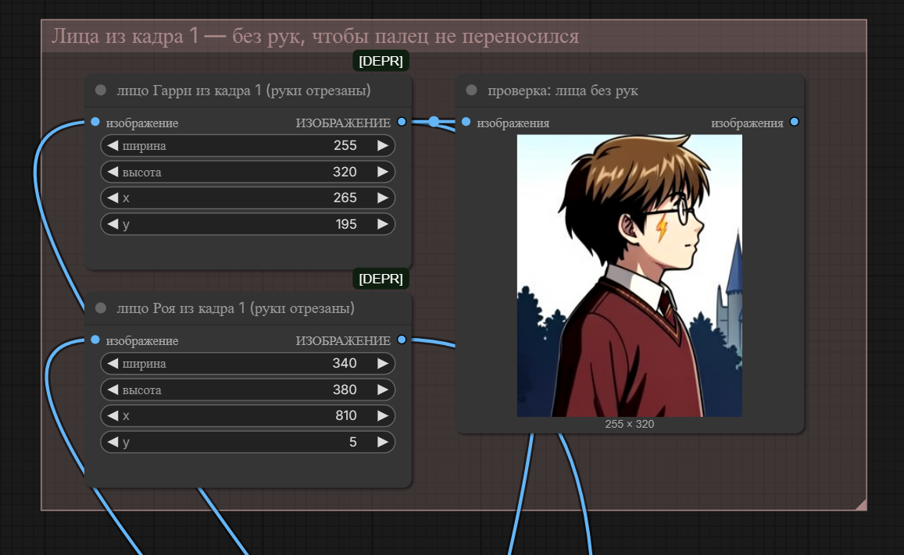
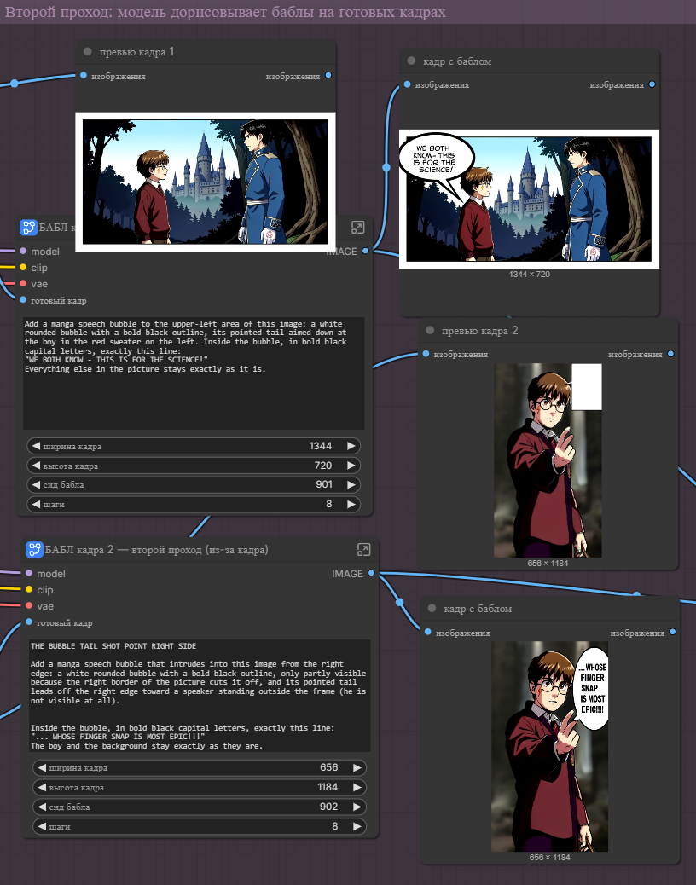
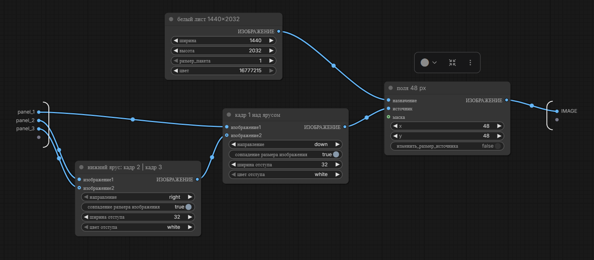

# Воркфлоу

Оба файла открываются перетаскиванием прямо в окно ComfyUI. Как поставить ComfyUI и модели — в [README в корне](../README.md).

---

## `meme_generation_example_workflow.json`

**5 нод.** С этого стоит начинать.

Берёт две картинки и перерисовывает первую в стиле второй: люди на фото превращаются в мультяшных персонажей, поза и композиция сохраняются.

```
Загрузить изображение ─┐
                       ├─→ Image Edit (Flux.2 Klein 4B) ─→ Сохранить изображение
Загрузить изображение ─┘
```

Вся работа спрятана в один сабграф `Image Edit` — внутри него 17 нод: загрузка модели, текстовый энкодер, семплер, VAE.

**Нужные модели:** `flux-2-klein-4b-fp8`, `qwen_3_4b`, `flux2-vae`.

**Что крутить:**
- текст промпта — пиши по пунктам, отдельным пунктом проси не рисовать лишние конечности;
- `noise_seed` — «бросок кубика», меняет результат при том же промпте.



---

## `manga_page_3_panels_v2.json`

**40 нод, 5 групп, 4 сабграфа, 62 связи.** Собирает готовую страницу манги 1440×2032 из трёх кадров.

**Нужные модели:** `flux-2-klein-9b-fp8`, `qwen_3_8b_fp8mixed`, `flux2-vae`, LoRA `flux2_klein_9b_refcontrol_canny`.

### Группы внутри

| Группа | Что делает |
|---|---|
| Модель и общие настройки | Загружает модель, текстовый энкодер, VAE и LoRA |
| Общие референсы на всю страницу | Лист персонажа и образец стиля — подмешиваются в каждый кадр |
| Карты структуры жеста (фото → Canny) | Обычные фото превращаются в контуры, по которым модель повторяет позу |
| Лица из кадра 1 — без рук | Кропы лиц, чтобы модель не перетащила на новый кадр лишний палец |
| Второй проход: баблы | На готовые кадры отдельно дорисовываются речевые баблы |

Последний сабграф `СТРАНИЦА` склеивает три кадра на белый лист: отступ между кадрами 32 px, поля страницы 48 px.

### Разбор пайплайнов

| | |
|---|---|
|  | **Позы через Canny.** Фото руки и фигуры обводятся по контуру — модель повторяет жест |
|  | **Лица без рук.** С готового кадра вырезаются только лица |
|  | **Баблы вторым проходом.** Текст задаётся дословно, кадр не перерисовывается |
|  | **Сборка страницы.** Белый лист, стыковка кадров, поля |

Результат — [`../assets/final_page.png`](../assets/final_page.png).
